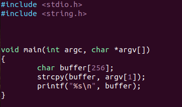
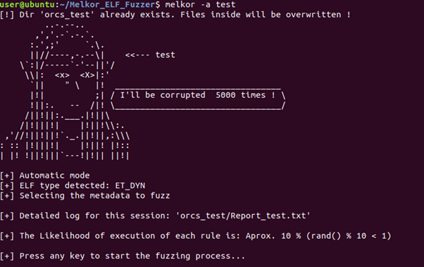
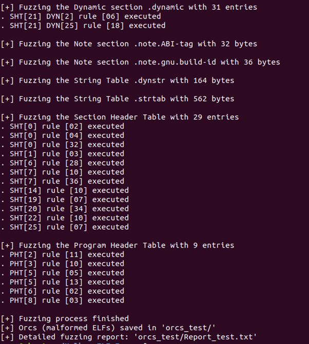
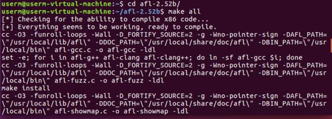
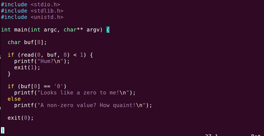
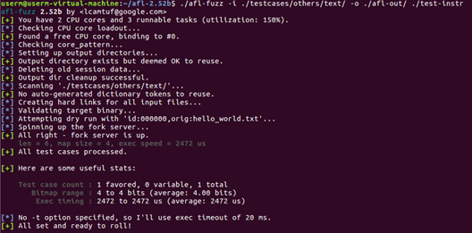
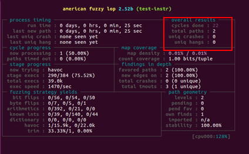
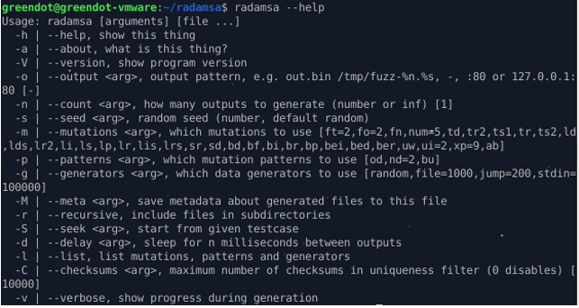
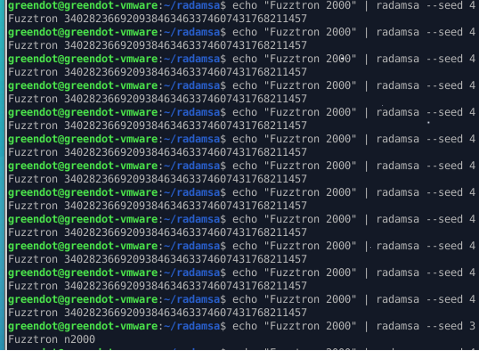
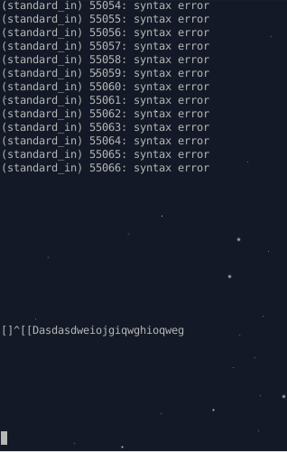

# fuzzing 툴 분석

## 1. Melkor fuzzer

> https://github.com/IOActive/Melkor_ELF_Fuzzer

Linux 시스템에서 ELF 파일에 대한 fuzzing을 위한 툴이다.

#### 사용법

``` bash
Usage: melkor <ELF metadata to fuzz><ELF file template>[-n num -l likelihood -q]

<ELF metadata to fuzz>:

-       -a: Autodetect (fuzz according to e_type except -H [the header])
-       -H: ELF header
-       -S: Selection Header Table
-       -P: Program Header Table
-       -D: Dynamic section
-       -s: Symbols Table(s)
-       -R: Relocations Table(s)
-       -N: Notes section
-       -Z: String Tables
-       -A: All of the above(except -a[Autodetect])
-       -B: All of the above(except -a[Autodetected] and -H[ELF Header])
-       -q: Quiet mode(doesn’t print to STDOUT every executed fuzzing rule)
```

#### 섹션 헤더

- SHT_NULL

  이 값은 섹션 헤더를 비활성으로 표시합니다. 관련 섹션이 없습니다. 섹션 헤더의 다른 멤버에는 정의되지 않은 값이 있습니다.

- SHT_PROGBITS

  섹션은 프로그램에 의해 정의 된 정보를 보유하며, 프로그램의 형식과 의미는 프로그램에 의해서만 결정됩니다.

- SHT_SYMTAB 과 SHT_DYNSYM

  <="" a="">이 섹션에는 기호 표가 있습니다. 현재 오브젝트 파일에는 각 유형마다 섹션이 하나만있을 수 있지만이 제한 사항은 향후 완화 될 수 있습니다. 일반적으로 SHT_SYMTAB 링크 편집을위한 기호를 제공하지만 동적 링크에도 사용할 수 있습니다. 전체 심볼 테이블로, 동적 연결에 불필요한 많은 심볼을 포함 할 수 있습니다. 결과적으로, 오브젝트 파일은 SHT_DYNSYM 공간을 절약하기 위해 최소한의 동적 링킹 심볼 세트를 보유하는 섹션을 포함 할 수도 있습니다 .  오.

- SHT_STRTAB

  섹션에는 문자열 테이블이 있습니다. 객체 파일에는 여러 개의 문자열 테이블 섹션이있을 수 있습니다. 

- SHT_RELA

  섹션 Elf32_Rela은 오브젝트 파일의 32 비트 클래스에 Elf64_Rela대한 유형 또는 오브젝트 파일 의 64 비트 클래스에 대한 유형과 같은 명시적인 가수가있는 재배치 항목을 보유 합니다. 오브젝트 파일에는 여러 재배치 섹션이있을 수 있습니다. 

- SHT_HASH

  섹션은 심볼 해시 테이블을 포함합니다. 현재 개체 파일에는 해시 테이블이 하나만있을 수 있지만이 제한은 나중에 완화 될 수 있습니다. 

- SHT_DYNAMIC

  이 섹션에는 동적 연결에 대한 정보가 있습니다. 현재, 오브젝트 파일은 동적 섹션을 하나만 가질 수 있지만,이 제한은 장래에 완화 될 수 있습니다. 

- SHT_NOTE

  이 섹션에는 파일을 어떤 식 으로든 표시하는 정보가 들어 있습니다.

- SHT_NOBITS

  이 유형의 섹션은 파일에서 공백을 차지하지 않지만 다른 경우에는 유사 SHT_PROGBITS합니다. 이 섹션에는 바이트가 없지만 sh_offset 멤버에는 개념적 파일 오프셋이 포함됩니다.
- SHT_REL

  이 섹션에는 Elf32_Rel32 비트 클래스의 오브젝트 파일에 Elf64_Rel대한 유형 또는 64 비트 클래스의 오브젝트 파일에 대한 유형과 같이 명시적인 가중치가없는 재배치 항목이 있습니다. 오브젝트 파일에는 여러 재배치 섹션이있을 수 있습니다. 

- SHT_SHLIB

  이 섹션 유형은 예약되었지만 지정되지 않은 의미를가집니다.

- SHT_LOOS ...을 통하여 SHT_HIOS

  이 포함 범위의 값은 운영 체제 관련 의미론을 위해 예약되어 있습니다.

- SHT_LOPROC ...을 통하여 SHT_HIPROC

  이 포함 범위의 값은 프로세서 관련 의미론을 위해 예약되어 있습니다.

- SHT_LOUSER

  이 값은 응용 프로그램 용으로 예약 된 색인 범위의 하한을 지정합니다.

- SHT_HIUSER

  이 값은 응용 프로그램 용으로 예약 된 색인 범위의 상한을 지정합니다. 현재 또는 미래의 시스템 정의 섹션 유형과 충돌하지 않고 응용 프로그램이 사용하는 섹션 유형 SHT_LOUSER및 SHT_HIUSER사용할 수 있습니다.


#### 실습

- 타깃 프로그램

  해당 프로그램은 오버플로우에 취약한 단순한 프로그램이다.

  - 소스코드

    

  - 실행 화면

    

    


    실행 후 실행 결과인 report가 ‘/orcs_test/에 저장된 것을 확인할 수 있다.
    
    


    하이라이트 쳐 둔 부분을 열어보면 아래와 같이 fuzzing한 결과를 알 수 있다.
    
    


## 2. AFL(American Fuzzy Lop)

타킷 파일을 컴파일을 통해 퍼징을 하여 분석하는 프로그램, 코드를 필요로 함

#### 실습

1. 내려받기 & 설치

``` bash
wget http://lcamtuf.coredump.cx/afl/releases/afl-latest.tgz
tar -xvf afl-latest.tgz 
cd afl-2.52b/
make all
sudo make install
```





2. AFL을 이용하여 타깃 프로그램 컴파일

   ``` bash
   ./afl-gcc -o test-instr test-instr.c
   ```

   

   - 테스트 프로그램 소스 코드

     


3. 퍼징

   ``` bash
   sudo ./afl-fuzz -i ./testcases/others/text/ -o ./afl-out/ ./test-instr 
   ```

   

   

4. 결과 확인

   지정 해줬던 afl-out 폴더에 결과가 저장된다.

   ``` bash
   cd afl-out
   ```

   


## 3. Radamsa

퍼징 테스팅 도구, 설치와 사용이 간단

#### 설치

1. 내려받기 & 설치

   ``` bash
   git clone https://gitlab.com/akihe/radamsa
   make
   sudo make install # optional, you can also just grab bin/radamsa
   ```

2. 테스트

   ``` bash
   radamsa --help
   ```

   

#### 실습

- 간단한 문자열 퍼징

  ``` bash
  echo "aaa" | radamsa
  ```


  


  ``` bash
  echo "Fuzztron 2000" | radamsa --seed 4
  ```

  시드도 설정이 가능함

  

- 유닉스 유틸리티 bc(계산기)에 퍼징

  ``` bash
  echo "100 * (1 + (2 / 3))" | radamsa -n 10000 | bc
  ```

  - 실행결과

    - 행걸린 경우

      

    - 비정상 종료

      


