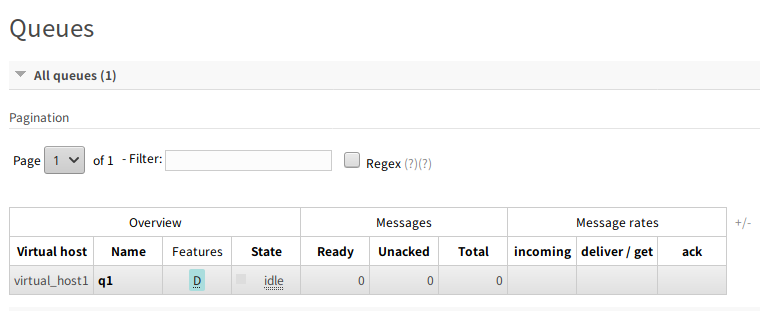

# 테스트베드 환경 구축하기

- 구성

  Producer — Server — Consumer

  - Producer

    10.0.0.1/24

  - Server

    10.0.0.2/24

  - Consumer

    10.0.0.3/24

    

## 1. 세팅

- VM 하나를 생성합니다.

  - VM 세팅

    - 디스크 용량 20GB
    - 메모리 용량 2GB
    - OS: Ubuntu 18.04 LTS(저사양의 경우 Xubuntu, Lubuntu 추천)
    - 네트워크: 브릿지(나중에 host-only로 변경합니다.)

  - OS 세팅

    1. 운영체제 설치를 합니다.

    2. 설치가 완료되면 아래의 기본적인 설정을 합니다.

       - 레포를 업데이트합니다.
       - vmware와의 호환을 도와주는 툴을 설치합니다.
       - 기본적으로 필요로하는 프로그램을 설치합니다.

       ~~~ bash
       sudo apt update
       sudo apt install open-vm-tools open-vm-tools-desktop
       sudo apt install vim git curl gcc make wget python-pip -y
       ~~~

    3. VM을 종료합니다.

       ~~~ bash
       sudo halt
       ~~~

- 생성한 VM을 복제합니다.

- Producer 세팅

  1. 해당 VM을 켭니다.

  2. Mosquitto-clients 설치

     ~~~ bash
     sudo apt install mosquitto-clients
     mosquitto_pub		## 	제대로 설치가 되었는지 확인
     ~~~

  3. mqtt_fuzz 설치

     <https://github.com/F-Secure/mqtt_fuzz>

     mqtt_fuzz가 Radamsa를 필요하므로 먼저 설치한다.

     ~~~bash
     git clone https://gitlab.com/akihe/radamsa.git
     cd radamsa
     sudo make
     radamsa		## 제대로 설치가 되었는지 확인
     
     # ==============
     # 만약 에러 발생시
     ## radamsa 폴더에서
     rm radamsa.c
     sudo make
     sudo make install
     # ==============
     
     pip install Twisted
     git clone https://github.com/F-Secure/mqtt_fuzz.git
     cd mqtt_fuzz
     python mqtt_fuzz.py		## 제대로 설치가 되었는지 확인
     ~~~

  4. mqtt 메시지 테스트를 하기 위한 스크립트 생성

      ~~~ bash
     cd ~
     vi test.sh
     
       #! /bin/sh
       while:
       do
         TIME=`date`
         MSG="[$TIME] A client send to B client"
         mosquitto_pub -h 10.0.0.2 -p 1883 -t /device -u test -P yana6728 -m "$MSG"
         echo $MSG
         echo "[CTRL+c]를 누르면 멈춥니다."
         sleep 1
       done
     ~~~

- Server 세팅

  1. 해당 VM을 켭니다.

  2. Rabbitmq 설치

     ``` bash
     sudo apt install rabbitmq-server
     sudo service rabbitmq-server status	## 서비스 켜져 있는지 확인
     netstat -tnlp | grep 5672		## 5672 포트 확인
     ```

  3. 관리용 플러그인, mqtt 플러그인 활성화 및 관리자 계정 설정

     ~~~ bash
     # 플러그인 설치
     sudo rabbitmq-plugins enable rabbitmq_management
     sudo rabbitmq-plugins enable rabbitmq_mqtt
     
     # 계정 생성과 계정에 관리자 권한 부여
     sudo rabbitmqctl add_user test yana6728
     sudo rabbitmqctl set_user_tags test administrator
     
     sudo service rabbitmq-server restart
     ~~~

  4. mqtt 메시지 테스트를 하기 위한 Queue와 Exchange 설정

     - management UI 접속
       - 해당 VM 내의 브라우저를 통해 아래 사이트 접속

         http://localhost:15672

     - virtual host 설정

       

       

     - 큐생성

       

     

     - 교환설정

       

       - virtual_host1 - amq.topic에서 설정
       - Bindings에서 To를 q1으로 설정
       - 라우팅 키 '#'은 모든 요청에 대한 응답
       - 즉, 모든 요청이 q1 큐로 들어가게 되는것

- Consumer 세팅

  1. 해당 VM을 켭니다.

  2. Mosquitto-clients 설치

     ~~~ bash
     sudo apt install mosquitto-clients
     mosquitto_sub		## 	제대로 설치가 되었는지 확인
     ~~~


## 2. 네트워크 세팅

- 인터넷이 연결된 상태에서의 구축은 완료되었으므로 이제 네트워크를 구성한다.

- 네트워크는 10.0.0.1 ~ 3/24 를 사용할 것이며, 해당 네트워크는 외부랑 관련 없이 독립된다.

- 순서는 호스트네임을 설정후 IP를 설정 할 것이다.

  또한, 우분투 18.04 LTS 이전 버전인 경우 네트워크 설정하는 netplan이 없으므로 주의를 요구한다.

- 세팅 방법이 비슷한 부분이 많으므로 IP만 다르게 각각의 VM에서 설정해주면 된다.

### 설정

- 호스트네임 설정

  **호스트 명은 VM 별로 각각 producer, server, consumer로 지정 해주면된다.**

  ``` bash
  hostnamectl set-hostname [호스트 명]
  ```

- hosts 설정

  IP를 굳이 사용하지 않아도 hostname으로 IP를 알아 볼수 있게 설정한다.

  즉, "ping 10.0.0.3" 할 필요없이 "ping consumer" 해도 알아서 이해하게 해주는 것이다.

  맨 아래 추가 해주면 된다.

  ~~~bash
  vi /etc/hosts
  
  10.0.0.1		producer
  10.0.0.2		server
  10.0.0.3		consumer
  
  ~~~

  

- IP 설정

  기존 인터넷과 연결된 네트워크 인터페이스인 ens33을 고정 IP로 설정한다.

  **IP는 VM 별로 각각 10.0.0.1/24, 10.0.0.2/24, 10.0.0.3/24로 지정 해주면된다.**

  ~~~yaml
  sudo -i
  service network-manager stop
  ~~~

  ~~~ bash
  vi /etc/netplan/02-init.yaml
  network:
  		ethernets:
  				ens33:
  					addresses: [IP/24]
  					dhcp: no		# 반드시 no로 해야 static으로 됩니다.
  		version: 2
  ~~~

  ~~~ bash
  netplan apply
  ip addr			# 	설정된 ip 확인
  ~~~

  네트워크 매니저 GUI인 작업 표시줄의 연결 아이콘을 눌러 netplan-ens33 활성화 해준다.

  VM이 2개 이상 설정되면 꼭 아래 처럼 ping으로 확인 해주고 다음 VM의 네트워크를 설정해야한다.

  ~~~ bash
  # producer -> server로 ping
  ping 10.0.0.2
  ~~~

  

## 3. 테스트

네트워크 까지 설정된 환경이 구축되면 테스트를 한다.

모든 VM이 켜져있어야 하면 서로간의 ping 통신이 된 상태여야한다.

- 실습

  producer에서 mqtt 메시지를 날려 consumer에서 확인한다.
   - server

     ``` bash
     # 서버가 켜져있는지 확인
     service rabbitmq-server status
     
     # 터미널 창을 하나 더 띄우고 메시지 로그를 확인하는 tail을 실행
     tail -f /var/log/rabbitmq/rabbit@xxxxxxxxxxx.log
     ```

     또한 브라우저로 management Web UI를 로그인 해두고 켜둬야 한다.

     - http://localhost:15672

  - producer

    아까 [세팅](##1.-세팅) 에서 작성한 스크립트를 실행한다.

    ``` bash
    ~/test.sh
    ```

  - consumer

    mosquitto_sub를 통해 메시지를 수신한다.

    토픽을 q1으로 설정했으므로 지정해준다.

    ~~~ bash
    mosquitto_sub -d -t q1
    ~~~


​	consumer가 mqtt 수신을 한다면 테스트 환경 구축이 끝난것이다.

​	mqtt_fuzz는 producer에서 test.sh 대신에 실행시켜 주면된다.